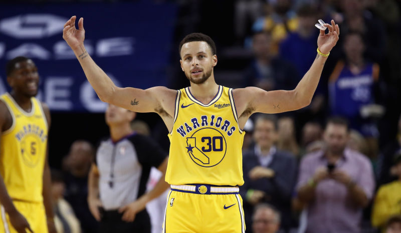
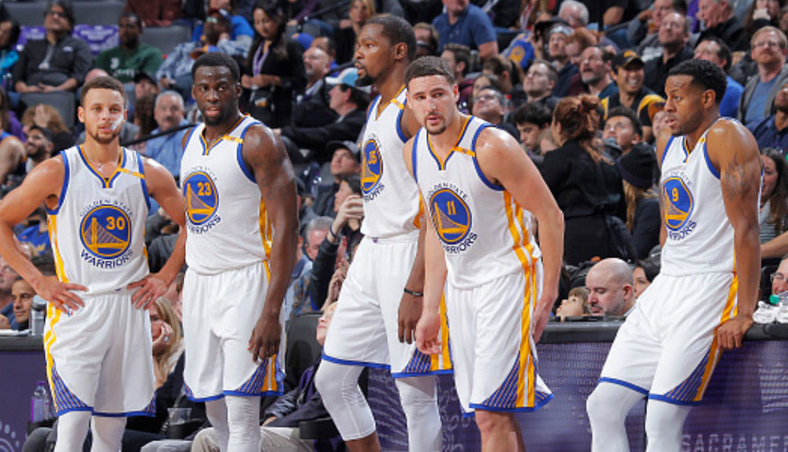
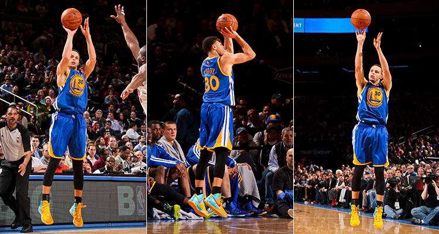
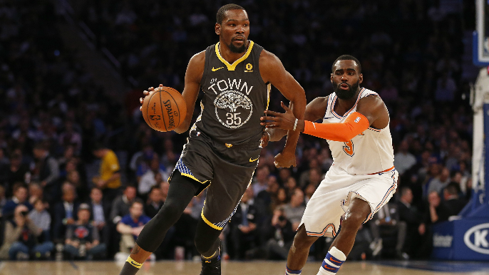

```{r setup, include=FALSE}
knitr::opts_chunk$set(echo = TRUE)
library(dplyr)
```

***

# The Gold Behind Golden State: Analyzing Shooting Statistics of Elite Golden State Players

```{r image 1, out.width='80%', echo=FALSE, fig.align='center'}
knitr::include_graphics('../images/warriors.jpg')
```

#### Contents
1. [Introduction](#introduction)  
2. [Background](#background)
3. [Data](#data)
4. [Analysis](#analysis)
     i. [Shooting Position](#shooting-position)
     ii. [Shooting Action](#shooting-action)
     iii. [Shooting Efficiency](#shooting-efficiency)
5. [Results](#results)
6. [Conclusions](#conclusions)
7. [References](#references)

***

### Introduction

The Golden State Warriors are consistently among the most dominant teams in the modern NBA, with four championship appearances and three championship victories in the last four years.<sup>[1](#footnotes)</sup> A large factor in the superiority of the Warriors is their offense: the Warriors are able to consistently score among the most points of any team in the NBA. For example, in 2016, the Warriors were the highest scoring team in the league, with 9,491 points, as shown in the table below.  

| Team | Total Points | Average Points per Player | Median Points per Player |
|------|--------------|---------------------------|--------------------------|
| GSW  | 9491         | 593                       | 408                      |
| HOU  | 9065         | 648                       | 568                      |
| LAC  | 8911         | 594                       | 538                      |
| BOS  | 8857         | 590                       | 515                      |
| DEN  | 8783         | 517                       | 587                      |

Another interesting fact to note from the table above is that the mean points per player for the Warriors is higher than the median points per player — which implies a skew-right distribution. This means that the majority of GSW players are not scoring too many points — implying that a few players on the GSW roster make up for a majority of the points scored, as shown in the figure below.  

```{r graph 1, out.width='80%', echo=FALSE, fig.align='center'}
knitr::include_graphics('../images/gsw-points-graph.png')
```

The motivation for this report is to examine these "powerhouse" players on the Golden State Warriors squad. Specifically, we will examine the shooting patterns of Andre Iguodala, Draymond Green, Kevin Durant, Klay Thompson, and Stephen Curry. **What makes these players such dominant scorers?** In this report, we will examine shooting patterns and shooting efficiency to attempt to answer this question.

***

```{r image 2, out.width='80%', echo=FALSE, fig.align='center'}

```

### Background

As discussed above, the majority of the Warriors offence is generated by a core powerhouse group of players. In 2016, the year we shall examine, this core group consisted of Andre Iguodala (SF), Draymond Green (PF), Kevin Durant (PF), Klay Thompson (SG), and Stephen Curry (PG). As shown in the table below, these five players account for 6,646 out of the total 9,491 points scored by the Warriors: five players accounting for an impressive **70%** of total scored points.

| Player         | Points |
|----------------|--------|
| Andre Iguodala | 574    |
| Draymond Green | 776    |
| Kevin Durant   | 1555   |
| Klay Thompson  | 1742   |
| Stephen Curry  | 1999   |
| Total          | 6646   |

Therefore, we now aim to examine these five players — what makes this core group such effective points scorers? Some possible factors that we shall examine are:

1. The **location** on the court from which these players take their shots  
     + We shall examine this through the use of *shot charts*
     
2. The type of **shooting action** performed
     + Do these players shoot more 2-PT shots? 3-PT shots?
     + Do these players shoot more jump shots? Layups?
   
3. The **efficiency** of their shooting (i.e., proportion of made shots to attempted shots)
     + We shall examine this through the use of *Effective Shooting Percentages*

By examining these factors, we will draw conclusions on the shooting tendencies of these five players, shedding light on why they are able to score so many points.

***

```{r image 3, out.width='80%', echo=FALSE, fig.align='center'}

```

### Data

The data in this report is downloaded directly from Basketball Reference ([link](https://www.basketball-reference.com/)). All data is from the 2016-2017 season. The raw data is contained in separate CSV files for each player, with game statistics and shooting statistics. Here is an example of the first few lines of the data for Andre Iguodala:

```{r table 1, echo = FALSE}
# first 5 lines of andre iguodala data
andre = read.csv('../data/andre-iguodala.csv')
head(andre, n = 5)
```

As we can see, important data points for our research incude shot types, shot distances, and the (x,y) coordinates of the shot. These data points will allow us to analyze the location and shot type of each shot for these five players, which will in turn allow us to draw conclusions on their shot tendencies.  

To achieve statistics on all five GSW players, we combined their individual data sets into one large data set, which has identical structure to the individual CSV files, it simply contains all of the data. This was done through a simple R command, shown below for reference:

```{r example 1, eval = FALSE}
# R code showing how to combine data sets into single data frame
shots_data = rbind(iguodala, green, durant, thompson, curry)
```

Another important data set we will use is a CSV file containing data for all NBA players in the 2016 season. This data set provides background information on the NBA as a whole, so we can compare how the Warriors' powerhouse five compares to the rest of the NBA (as we did in the introduction and background sections). Here is a peek at that data set:

```{r table 2, echo = FALSE}
# first 5 lines of all nba players data
nba_players = read.csv('../data/nba2018-players.csv')
head(nba_players, n = 5)
```

Evidently, this data set does not give us data on the shooting of NBA players, so we cannot compare GSW shooting to other players' shooting. However, this data does contain point totals, which we can use as a benchmark for GSW players (as we did above).

***

```{r image 4, out.width='80%', echo=FALSE, fig.align='center'}
knitr::include_graphics('../images/curry.jpg')
```

### Analysis

#### 1. Shooting Position

The first shooting factor that we shall analyze is the **position** on the court from which each player tends to shoot. To get a general idea of the position from which our particular Warriors' players shoot, we create a chart which shows made and missed shot positions. We create this chart with a simple ggplot2 command:

```{r example 2, eval = FALSE}
ggplot(data = shots_data) +
  annotation_custom(court_image, -250, 250, -50, 420) +
  geom_point(aes(x = x, y = y, color = shot_made_flag), size = .5) +
  ylim(-50, 420) +
  ggtitle('Shot Charts: GSW (2016 season)') +
  facet_wrap(~ player) +
  theme_minimal()
```

Which returns the following chart:

```{r graph 2, out.width='80%', echo=FALSE, fig.align='center'}
knitr::include_graphics('../images/gsw-shot-charts.png')
```

From these charts, we can draw a few general tendencies. Notably, **players that score significantly greater amounts of points attempt significantly more shots.** Consider Kevin Durant, Klay Thompson, and Stephen Curry: each scoring over 1,500 points on the season. Their shot charts are notably more populated than Iguodala's and Green's: implying that Curry, Thompson, and Durant take more shot attempts than other players. Note that many of these shot attempts are outside of the paint (the rectangular region around the net), implying that effective shooters score from mid and long range.  

Another trend is that players who score more points **attempt more 3PT shots.** Consider Curry and Thompson's shot charts: the area above the 3PT line is more populated on their charts than on other players' charts. This is corroborated by summary statistics obtained from the data sets. More on this shall be discussed in the next subsection, which will examine the types of shots that these successful players take.  

```{r image 5, out.width='80%', echo=FALSE, fig.align='center'}

```

#### 2. Shooting Action

So, we have examined visually the position from which effective shooters on the Warriors shoot: not only do they shoot a lot, but also they shoot many more 3-PT shots.  

Just how often do these elite players shoot three-pointers? This question can be analyzed through the examination of summary tables.  

These summaries are obtained through a simple command, shown below:

```{r example 3, eval = FALSE}
summary(iguodala)
```

Here is an example of the output for Andre Iguodala's summary statistics:

```{r summary 1, echo = FALSE}
summary(andre)
```

By analyzing summary statistics for all five players, we can draw some more general trends about shot types. For instance, top scorers such as Stephen Curry shoot more 3-PT shots than 2-PT shots: Curry shot 563 2-PT shots and 687 3-PT shots. These totals are a marked difference from lowerer scorers, such as Iguodala or Green, who shoot much more 2-PT shots than 3-PT shots. A notable outlier to this is Kevin Durant, who shot 643 2-PT shots and only 272 3-PT shots, but still scored over 1,500 points. How does Durant score so many points on so few 3-PT shots? One answer is shooting efficiency, which we shall examine in a later section.    

Another aspect of the shot to consider is the **shot type.** Do elite players shoot more layup shots, jump shots, or some other shot? We examine this question again using summary statistics. The five players on the Warriors squad shot a total of 4,334 shots on the 2016 season. Of these shots, the jump shot is the most common shot, accounting for 2,051 of total shots (47%). However, what sets the more elite points scorers (Durant, Thompson, Curry) from the rest (Iguodala, Green) is a *variety* of jump shot variations. For elite points scorers, the second most common shot is always a variation on the jump shot, notably the pullup jump shot, and often their third most common shot is also a jump shot. Compare this to Iguodala and Green, who both have the layup shot as one of their top-three most common shots. Therefore, another trend in the data is that more elite points scorers are able to utilize variations on the jump shot more often. This trend is corroborated by the shooting charts: players who score more points tend to have relatively more shots outside of the paint region than players who score less points. Consider Klay Thompson, who scores relatively more points than Andre Iguodala. Their charts are shown below: 

```{r graph 3, out.width='80%', echo=FALSE, fig.align='center'}
knitr::include_graphics('../images/andre-iguodala-shot-chart.png')
```

```{r graph 4, out.width='80%', echo=FALSE, fig.align='center'}
knitr::include_graphics('../images/klay-thompson-shot-chart.png')
```

Evident in the magnified shot charts, players who score more points, such as Klay Thompson, are able to shoot from areas outside of the paint much more effectively than players who score less, such as Andre Iguodala. This is consistent with our analysis of shot types: the jump shot is effective at mid-range, whereas the layup is typically used in the paint. **Players who shoot from outside of the paint have an effective jump shot, and are thus able to score more points.**  

> “The mid-range shot is a huge weapon”<sup>[2](#footnotes)</sup> —Steve Kerr, Head Coach of the Warriors

Even Steve Kerr agrees that the jump-shot is the most effective way to score points, corroborating our analysis.


```{r image 6, out.width='80%', echo=FALSE, fig.align='center'}
knitr::include_graphics('../images/klay-thompson-shooting.jpg')
```

#### 3. Shooting Efficiency


The final factor of the shot that we analyze is the **efficiency** of the shot. We have found that effective scorers attempt a larger amount of shots, but out of their total attempted shots, what percentage do elite players make? This question can be analyzed through the use of an *Effective Shooting Percentage tables*.  

This table is constructed by comparing shots made to shots taken, where percentage made is equal to shots made divided by total shots (giving an effective shooting percentage). We construct this table with a quick R script using as inputs each individual's shot data CSV file. The script and dataframe output are shown below, for reference:

```{r code 1, warning = FALSE}
### Make Effective Shooting Table Script

## Description: This script creates an effective shooting table for all players, comparing percentage of shots made to shots taken.

## Inputs:
# andre-iguodala.csv
# draymond-green.csv
# kevin-durant.csv
# klay-thompson.csv
# stephen-curry.csv

## Outputs:
# data frame showing effective shooting percentage

####

# read data sets
iguodala = read.csv("../data/andre-iguodala.csv", header = TRUE, stringsAsFactors = FALSE, colClasses = c("character", "character", "integer", "integer", "integer", "integer", "character", "factor", "factor", "integer", "factor", "integer", "integer"))
green = read.csv("../data/draymond-green.csv", header = TRUE, stringsAsFactors = FALSE, colClasses = c("character", "character", "integer", "integer", "integer", "integer", "character", "factor", "factor", "integer", "factor", "integer", "integer"))
durant = read.csv("../data/kevin-durant.csv", header = TRUE, stringsAsFactors = FALSE, colClasses = c("character", "character", "integer", "integer", "integer", "integer", "character", "factor", "factor", "integer", "factor", "integer", "integer"))
thompson = read.csv("../data/klay-thompson.csv", header = TRUE, stringsAsFactors = FALSE, colClasses = c("character", "character", "integer", "integer", "integer", "integer", "character", "factor", "factor", "integer", "factor", "integer", "integer"))
curry = read.csv("../data/stephen-curry.csv", header = TRUE, stringsAsFactors = FALSE, colClasses = c("character", "character", "integer", "integer", "integer", "integer", "character", "factor", "factor", "integer", "factor", "integer", "integer"))

# create vectors for data frame
name = c("Andre Iguodala", "Draymond Green", "Kevin Durant", "Klay Thompson", "Stephen Curry")
total = c(length(iguodala$shot_made_flag), length(green$shot_made_flag), length(durant$shot_made_flag), length(thompson$shot_made_flag), length(curry$shot_made_flag))
made = c(length(iguodala$shot_made_flag[iguodala$shot_made_flag == 'y']), length(green$shot_made_flag[green$shot_made_flag == 'y']), length(durant$shot_made_flag[durant$shot_made_flag == 'y']), length(thompson$shot_made_flag[thompson$shot_made_flag == 'y']), length(curry$shot_made_flag[curry$shot_made_flag == 'y']))
perc_made = made / total

# create effective shooting percentage table

eff_tot_shot = data.frame(name, total, made, perc_made)

# arrange in descending order

arrange(eff_tot_shot, desc(perc_made))

```

This is the Effective Shooting Percentage table outputted by the script above, in a more readable format.

| Player         | Total Shots | Shots Made | Percentage Made |
|----------------|-------------|------------|-----------------|
| Kevin Durant   | 915         | 495        | 54.1%           |
| Andre Iguodala | 371         | 192        | 51.8%           |
| Klay Thompson  | 1220        | 575        | 47.1%           |
| Stephen Curry  | 1250        | 584        | 46.7%           |
| Draymond Green | 578         | 245        | 42.4%           |

As we can see from the table, there is no significant trend that elite point scorers have high effective total shooting percentages. For instance, Stephen Curry, the highest point scorer on the Warriors squad, has the second lowest effective shooting percentage. In fact, Curry's shooting percentage is only marginally better than the league average (46%).<sup>[3](#footnotes)</sup> However, Curry has the most total shots attempted and the most shots made of any player. Thus, the trend we observe is that shooting percentage is not as important as the amount of shots taken: **quantity is more important than quality.**

> "You miss 100% of the shots you don't take" —Wayne Gretzky

The notable outlier to this is Kevin Durant, who is the third highest scorer on the warriors squad (and has over 1,500 points). Kevin Durant has the highest effective shooting percentage, and thus is able to score more on less shots. The general trend, however, is that more total shots leads to more points, rather than a higher percentage leading to more points.  

##### 2-PT Effective Shooting Percentage

We have analyzed the effective shooting percentage by player for total shots (sum of 2-PT and 3-PT shots). Let us now break down the total shots into 2-PT shots and 3-PT shots to further analyze shooting efficiency.  

We create a new table of 2-PT shooting efficiency. The code for this is similar to the code above, subsetting 2-PT shot data instead of total shot data. Here is the data frame outputted by such code:

```{r table 3, echo = FALSE}
### Make 2-PT Effective Shooting Table Script

## Description: This script creates an effective 2-PT shooting table for all players, comparing percentage of 2-PT shots made to shots taken.

## Inputs:
# iguodala
# green
# durant
# thompson
# curry

## Outputs:
# data frame showing effective 2-PT shooting percentage

####

# create vectors for data frame

name = c("Andre Iguodala", "Draymond Green", "Kevin Durant", "Klay Thompson", "Stephen Curry")
total2 = c(length(iguodala$shot_made_flag[iguodala$shot_type == '2PT Field Goal']), length(green$shot_made_flag[green$shot_type == '2PT Field Goal']), length(durant$shot_made_flag[durant$shot_type == '2PT Field Goal']), length(thompson$shot_made_flag[thompson$shot_type == '2PT Field Goal']), length(curry$shot_made_flag[curry$shot_type == '2PT Field Goal']))
made2 = c(length(iguodala$shot_made_flag[(iguodala$shot_made_flag == 'y' & iguodala$shot_type == '2PT Field Goal')]), length(green$shot_made_flag[(green$shot_made_flag == 'y' & green$shot_type == '2PT Field Goal')]), length(durant$shot_made_flag[(durant$shot_made_flag == 'y' & durant$shot_type == '2PT Field Goal')]), length(thompson$shot_made_flag[(thompson$shot_made_flag == 'y' & thompson$shot_type == '2PT Field Goal')]), length(curry$shot_made_flag[(curry$shot_made_flag == 'y' & curry$shot_type == '2PT Field Goal')]))
perc_made2 = made2 / total2

# create effective shooting percentage table

eff_tot_shot2 = data.frame(name, total2, made2, perc_made2)

# arrange in descending order

arrange(eff_tot_shot2, desc(perc_made2))

```

In a more readable format:

| Player         | Total 2-PT Shots | 2-PT Shots Made | 2-PT Percentage Made |
|----------------|------------------|-----------------|----------------------|
| Andre Iguodala | 210              | 134             | 63.8%                |
| Kevin Durant   | 643              | 390             | 60.7%                |
| Stephen Curry  | 563              | 304             | 54.0%                |
| Klay Thompson  | 640              | 329             | 51.4%                |
| Draymond Green | 346              | 171             | 49.4%                |

Again, from this table we see that shooting efficiency is not as important as volume of shots when it comes to scoring points. Because Andre Iguodala takes relatively few shots, he is able to retain a relatively high effective shooting percentage. Players such as Stephen Curry and Klay Thompson are the highest scorers on the Warriors, but their 2-PT shooting percentages are among the lowest of the five. This trend shows that **2-PT shooting percentage is not as important in the modern NBA as total shots attempted.** Again, we see the notable outlier being Kevin Durant. As discussed in the shooting position subsection, Kevin Durant takes relatively more 2-PT shots than 3-PT shots: an outlier trend among top points scorers, who usually take more 3-PT shots. The reason Durant is able to score so effectively on 2-PT shots is his shooting efficiency, as evident in the table. Durant has the most efficient 2-PT shot (60%) out of players who take over 500 2-PT shots. 

##### 3-PT Effective Shooting Percentage

Let us now consider 3-PT shooting efficiency. Again, we conduct our analysis through the use of a effective shooting percentage table, this time for 3-PT shots. Here is the output of the code:

```{r table 4, echo = FALSE}
### Make 3-PT Effective Shooting Table Script

## Description: This script creates an effective 3-PT shooting table for all players, comparing percentage of 3-PT shots made to shots taken.

## Inputs:
# iguodala
# green
# durant
# thompson
# curry

## Outputs:
# data frame showing effective 3-PT shooting percentage

####

# create vectors for data frame

name = c("Andre Iguodala", "Draymond Green", "Kevin Durant", "Klay Thompson", "Stephen Curry")
total3 = c(length(iguodala$shot_made_flag[iguodala$shot_type == '3PT Field Goal']), length(green$shot_made_flag[green$shot_type == '3PT Field Goal']), length(durant$shot_made_flag[durant$shot_type == '3PT Field Goal']), length(thompson$shot_made_flag[thompson$shot_type == '3PT Field Goal']), length(curry$shot_made_flag[curry$shot_type == '3PT Field Goal']))
made3 = c(length(iguodala$shot_made_flag[(iguodala$shot_made_flag == 'y' & iguodala$shot_type == '3PT Field Goal')]), length(green$shot_made_flag[(green$shot_made_flag == 'y' & green$shot_type == '3PT Field Goal')]), length(durant$shot_made_flag[(durant$shot_made_flag == 'y' & durant$shot_type == '3PT Field Goal')]), length(thompson$shot_made_flag[(thompson$shot_made_flag == 'y' & thompson$shot_type == '3PT Field Goal')]), length(curry$shot_made_flag[(curry$shot_made_flag == 'y' & curry$shot_type == '3PT Field Goal')]))
perc_made3 = made3 / total3

# create effective shooting percentage table

eff_tot_shot3 = data.frame(name, total3, made3, perc_made3)

# arrange in descending order

arrange(eff_tot_shot3, desc(perc_made3))

```

Again, arranged in a more readable format:

| Player         | Total 3-PT Shots | 3-PT Shots Made | 3-PT Percentage Made |
|----------------|------------------|-----------------|----------------------|
| Klay Thompson  | 580              | 246             | 42.4%                |
| Stephen Curry  | 687              | 280             | 40.8%                |
| Kevin Durant   | 272              | 105             | 38.6%                |
| Andre Iguodala | 161              | 58              | 36.0%                |
| Draymond Green | 232              | 74              | 31.9%                |

Interesting to note: the top three Warriors scorers are also top three in 3-PT shot efficiency. In fact, each of the top three scorers are above the league average for 3-PT shots (36%), with Curry and Thompson significantly over the league average.<sup>[3](#footnotes)</sup> This leads us to believe that **3-PT shot efficiency is more important than 2-PT shot efficiency** — as players who score more points are more efficient in 3-PT shooting, but not necessarily more efficient in 2-PT shooting. Still, we see that it is more effective to take more shots with slightly less efficiency: Stephen Curry scores more points than Klay Thompson, but has a lower 3-PT shot efficiency. However, the general trend is that 3-PT shot efficiency does seem to be more important than 2-PT shot efficiency.

***

```{r image 7, out.width='80%', echo=FALSE, fig.align='center'}

```

### Results

To reiterate the motivation of the report: we are examining **what makes the Warriors' powerhouse five players such dominant scorers?** Having conducted a thorough analysis of the data, let us state our results. 

**1. The most effective points scorers are able to utilize the entire offensive zone**

As evinced through our analysis of shooting position with shot charts, effective scorers can score from any region in the offensive zone: including beyond the 3-PT line, in the mid range between the 3-PT line and the paint, and inside of the paint. 

**2. An elite point scorer has a well-developed jump shot**
     
Through our analysis of shooting summary statistics, corroborated by shot charts, we conclude that the most dominant points scorers score primarily with the jump shot or variations on the jump shot. This makes their shooting effective not only in the paint, but also in mid and long ranges.

**3. When shooting, quantity is more important than quality**

As we saw with shot charts, summary statistics, and effective shooting percentage tables, the most important element when scoring points is a high volume of shots. Attempting shots is more important than shot efficiency — simply put: players who shoot more, score more.

**4. 3-PT shots are more important than 2-PT shots**

In terms of both shooting volume and shooting efficiency, it is much more important to shoot 3-PT shots than 2-PT shots. Shooting a majority of 3-PT shots leads to scoring more points, and an elite player not only shoots a lot of three-pointers, but is also efficient at 3-PT range.

***

```{r image 8, out.width='80%', echo=FALSE, fig.align='center'}
knitr::include_graphics('../images/maxresdefault.jpg')
```


### Conclusions

In conclusion, the dominance of the Golden State Warriors can, in part, be attributed to the tremendous amounts of points the team puts up. The majority of these points are scored by a so-called "powerhouse" five: in 2016 this squad consisted of Andre Iguodala, Draymond Green, Kevin Durant, Klay Thompson, and Stephen Curry. The dominance of Golden State's powerhouse five comes primarily from a commanding ability to score points.  

What makes these players such effective scorers is a **strong jump shot utilized from any spot in the offensive zone coupled with a large volume of shots, with particular emphasis on efficiency from the 3-PT line.** These factors are what separate Golden State's elite scorers from the rest of the league.  

What is the take home message from this analysis? The NBA has changed. Across his fifteen season career, from 1984 to 2003, Michael Jordan made only 581 3-PT shots.<sup>[4](#footnotes)</sup> Stephen Curry makes almost half that in a typical season. In the modern NBA, to be a successful scorer, you must be able to **shoot a lot, from any location in the offensive zone, with a special emphasis on the 3-PT shot.**

#### Take Home Message

> To succeed in the modern NBA, you must **shoot a lot, from any location in the offensive zone, with a special emphasis on the 3-PT shot.**


&nbsp;  

***  

&nbsp;  


### References

#### Data
1. [Basketball Reference](https://www.basketball-reference.com/)

##### Footnotes
1. [Wikipedia List of NBA Champions](https://en.wikipedia.org/wiki/List_of_NBA_champions)  
2. [WSJ Article on the Mid-Range Jumpshot](https://www.wsj.com/articles/the-mid-range-jumper-is-the-nbas-worst-shot-except-for-the-golden-state-warriors-1521557144)
3. [NBA 2016 League Shooting Averages](https://www.basketball-reference.com/leagues/NBA_stats_totals.html)
4. [Michael Jordan Stats](https://www.basketball-reference.com/players/j/jordami01.html)

##### Images

1. [Image of High Fiving Players](https://uproxx.files.wordpress.com/2015/02/usatsi_77987901.jpg?quality=100&w=650)
2. [Image of Steph Curry](https://i.kinja-img.com/gawker-media/image/upload/s--S8H4zPqx--/c_scale,f_auto,fl_progressive,q_80,w_800/wfjk2nrdqurtnow287kd.jpg) 
3. [Image of Starting 5](https://clutchpoints.com/wp-content/uploads/2017/01/Stephen-Curry-Draymond-Green-Kevin-Durant-Klay-Thompson-Andre-Iguodala-warriors-1000x574.jpg)
4. [Image of Curry Shooting](https://sports.mb.com.ph/wp-content/uploads/2018/01/AP18009229377072.jpg)
5. [Image of Curry Jumpshot](http://3.bp.blogspot.com/-__Bs9Zop2RU/VY0nXaZP3pI/AAAAAAAAAEc/fK4qSlJhRWk/s1600/s.curry.jpg)
6. [Image of Thompson Shot](https://cdn-s3.si.com/s3fs-public/2017/06/07/klay-thompson-shooing.jpg)
7. [Durant Dribbling](http://images.tritondigitalcms.com/6616/sites/82/2018/10/25130721/Kevin-Durant-Knicks.png)
8. [Image of GSW Champs](https://i.ytimg.com/vi/RRTsQmGM53c/maxresdefault.jpg)


