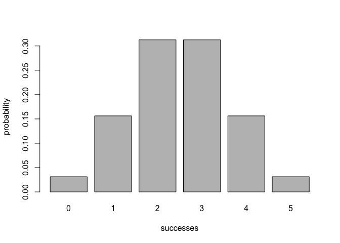
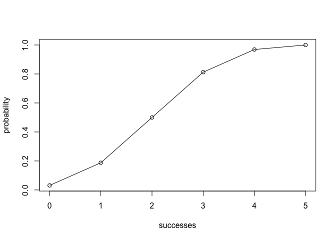

Workout 03: R Package binomial
------------------------------

------------------------------------------------------------------------

Binomial
--------

------------------------------------------------------------------------

> This [R](http://www.r-project.org/) package implements functions for calculating probabilities of a Binomial random variable, with related calculations such as probability distribution, expected value, etc.

### Table of Contents

------------------------------------------------------------------------

1.  [General Info](#general-info)
2.  [Motivation](#motivation)
3.  [Installation](#installation)
4.  [Usage](#usage)

### General Info

------------------------------------------------------------------------

`"binomial"` is a R package that provides and implements functions for calculating the probabilities of a Binomial random variable. The package includes related calculations, including probability distribution, expected value, variance, and others.

     - `bin_choose()` calculates the number of combinations in which *k* successes can occur in *n* trials.
     - `bin_probability()` calculates the binomial probability of getting a certain number of successes in a given number of trials
     - `bin_distribution()` returns a data frame of class `"bindis"` that returns the binomial probability distribution given a certain number of trials and probability of success
          * `plot.bindis()` method to display a histogram of a binomial distribution object `"bindis"`.
     - `bin_cumulative()` returns a data frame of class `"bincum"` that returns the binomial probability distribution and cumulative distribution given a certain number of trials and probability of success
          * `plot.bincum()` method to display a plot of a cumulative distribution object `"bincum"`.
     - `bin_var()` creates a binomial random variable object of class `"binvar"`.
          * `print.binvar()` method to print the content of an object `"binvar"`.
          * `summary.binvar()` method to give a full summary description of an object `"binvar"`.
     - `bin_mean` computes the mean of a binomial random variable given trials and probability
     - `bin_variance` computes the variance of a binomial random variable given trials and probability
     - `bin_mode` computes the mode of a binomial random variable given trials and probability
     - `bin_skewness` computes the skewness of a binomial random variable given trials and probability
     - `bin_kurtosis` computes the kurtosis of a binomial random variable given trials and probability

### Motivation

------------------------------------------------------------------------

This package illustrates the creation of an R package through the lens of a binomial functions.

### Installation

------------------------------------------------------------------------

Installation from GitHub with `"devtools"`:

``` r
# install devtools
#install.packages("devtools") 

# install "binomial" (without vignettes)
#devtools::install_github("stat133-sp19/hw-stat133-rgabidoulline/tree/master/workout03/binomial")

# install "binomial" (with vignettes)
#devtools::install_github("stat133-sp19/hw-stat133-rgabidoulline/tree/master/workout03/binomial", build_vignettes = TRUE)
```

### Usage

------------------------------------------------------------------------

``` r
library(binomial)

# k = 2 successes in n = 5 trials
bin_choose(n = 5, k = 2)
#> [1] 10

# probability of getting 2 successes in 5 trials
bin_probability(success = 2, trials = 5, prob = 0.5)
#> [1] 0.3125

# probability of 2 or less successes in 5 trials
bin_probability(success = 0:2, trials = 5, prob = 0.5)
#> [1] 0.03125 0.15625 0.31250

# binomial probability distribution
dist = bin_distribution(trials = 5, prob = 0.5)
dist
#>   success probability
#> 1       0     0.03125
#> 2       1     0.15625
#> 3       2     0.31250
#> 4       3     0.31250
#> 5       4     0.15625
#> 6       5     0.03125

# plot method
plot(dist)
```



``` r

# binomial cumulative distribution
cumdist = bin_cumulative(trials = 5, prob = 0.5)
cumdist
#>   success probability cumulative
#> 1       0     0.03125    0.03125
#> 2       1     0.15625    0.18750
#> 3       2     0.31250    0.50000
#> 4       3     0.31250    0.81250
#> 5       4     0.15625    0.96875
#> 6       5     0.03125    1.00000

# plot method
plot(cumdist)
```



``` r

# binomial random variable
X = bin_variable(trials = 10, p = 0.3)
X
#> "Binomial Variable"
#> 
#> Parameters 
#> - number of trials: 10 
#> - prob of success: 0.3

# summary method
summary(X)
#> "Summary Binomial"
#> 
#> Parameters 
#> - number of trials: 10 
#> - prob of success: 0.3 
#> 
#> Measures 
#> - mean    : 3 
#> - variance: 2.1 
#> - mode    : 3 
#> - skewness: 0.2760262 
#> - kurtosis: -0.1238095

# mean of distribution with trials = 10 and prob = 0.3
bin_mean(10, 0.3)
#> [1] 3

# variance of distribution with trials = 10 and prob = 0.3
bin_variance(10, 0.3)
#> [1] 2.1

# mode of distribution with trials = 10 and prob = 0.3
bin_mode(10, 0.3)
#> [1] 3

# skewness of distribution with trials = 10 and prob = 0.3
bin_skewness(10, 0.3)
#> [1] 0.2760262

# kurtosis of distribution with trials = 10 and prob = 0.3
bin_kurtosis(10, 0.3)
#> [1] -0.1238095
```
